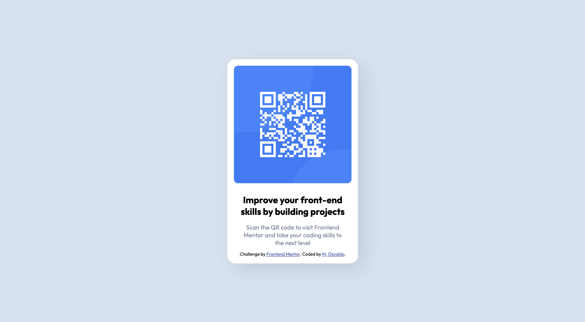

# Frontend Mentor - QR code component solution

This is a solution to the [QR code component challenge on Frontend Mentor](https://www.frontendmentor.io/challenges/qr-code-component-iux_sIO_H). Frontend Mentor challenges help you improve your coding skills by building realistic projects. 

## Table of contents

- [Overview](#overview)
  - [Screenshots](#screenshots)
  - [Solution links](#solution-links)
- [My process](#my-process)
  - [Built with](#built-with)
  - [Development process](#development-process)
  - [Continued development](#continued-development)
  - [Useful resources](#useful-resources)
- [Author](#author)

## Overview

### Screenshots
#### On mobile: 

#### On desktop:

### Solution links

- Solution URL: [GitHub repository](https://github.com/Ozzy-codes/frontendMentor-qrCode)
- Live Site URL: [GitHub page](https://ozzy-codes.github.io/frontendMentor-qrCode/)

## My process

### Built with

- Semantic HTML5 markup
- CSS Methologies
  - OOCSS (Object-Oriented CSS)
  - SMACSS (Scalable and Modular Architecture for CSS)
- Flexbox
- CSS Grid
- Mobile-first workflow
- Chrome Dev Tools 

### Development process

This is the first project I've taken on alone, and one of many I look forward to produce.

*Disclaimer* - I learned git after starting this project, therefore, I did not track project versions from start to finish.  

I approached writing this code similar to writing an essay, not too concerned with elegant code at first. Considering there was no  apparent card resizing between mobile and desktop versions, I focused my attention on the mobile design. I determined that from this view I may make a fixed width approximation. I determiend I could use CSS grid to center the card and use flexbox to vertically stack and align the 4 cards elements:  
- Img
- Heading
- Paragraph
- Footer

To approach the inital refactor, I utilized the chrome dev tools to examine which properties were necessary to maintain the product design.
Once completed, I tried to examine what the page may read through my machine spoken content funtion. I noticed that text didn't read naturally due to breaks I inserted via the ` ` element. Addressing this bug lead to an exploration of website accessbility. I added the extension [axe DevTools](https://www.deque.com/axe-devtools-accessibility-testing/?utm_term=axe%20devtools&utm_campaign=Search+-+axe+DevTools+-+Branded&utm_source=adwords&utm_medium=ppc&hsa_src=g&hsa_ad=537243498130&hsa_tgt=kwd-976060112777&hsa_mt=e&hsa_ver=3&hsa_acc=7854167720&hsa_kw=axe%20devtools&hsa_grp=122011560647&hsa_cam=12428499999&hsa_net=adwords&gclid=CjwKCAjwq-WgBhBMEiwAzKSH6INRsPMJCzaDcQh1bivTQGEfWFI8Y1zjwyqlpi2vj9mgQcnCogoYVRoCKvAQAvD_BwE) on my chrome browser, and investigated/updated accessibility issues flagged.

### Continued development

As a result of this process I'm interested in exploring: 
- The CSS property: `object-fit`
- Accessibility 

### Useful resources

There were a couple of resources I referenced to complete this project including material that rienforced my understanding of HTML, CSS concepts: 
- [CSS Grid Layout Crash Course - Traversy Media](https://www.youtube.com/watch?v=jV8B24rSN5o) - This video went a long way to teach me how to use CSS Grid. Straightforward tool. I expect that I will be using CSS grid over flexbox whenever applicable. 
- [CSS Methodology Review](https://www.creativebloq.com/features/a-web-designers-guide-to-css-methodologies#section-acss) - Brief review of a few CSS methodologies including OOCSS, BEM, SMACSS, and Atomic CSS. 
- [MDN Web Docs_](https://developer.mozilla.org/en-US/docs/Web/HTML/Content_categories#main_content_categories) - Referenced for HTML flow & sectioning content. 

## Author

- Frontend Mentor - [@Ozzy-codes](https://www.frontendmentor.io/profile/Ozzy-codes)
- GitHub - [Ozzy-codes](https://github.com/Ozzy-codes)